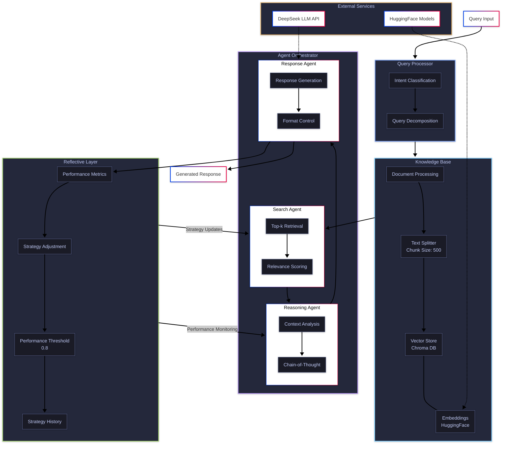
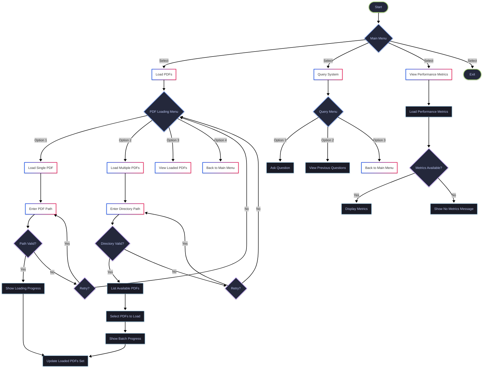

# Reflective Agentic RAG System

A sophisticated Retrieval-Augmented Generation (RAG) system implementing reflective agents and adaptive learning capabilities. This system combines state-of-the-art language models with intelligent document retrieval and dynamic strategy adjustment.

## Architecture Overview

The system is built on a modular architecture with four primary components:



### Key Components

1. **Query Processor**
   - Intent classification using zero-shot learning
   - Query decomposition for complex questions
   - Optimized for both direct and analytical queries

2. **Knowledge Base**
   - Document processing with configurable chunk sizes (default: 500 tokens)
   - Chroma vector store integration for efficient retrieval
   - HuggingFace embeddings for semantic representation

3. **Agent Orchestrator**
   - Search Agent: Handles document retrieval with dynamic top-k selection
   - Reasoning Agent: Implements chain-of-thought prompting
   - Response Agent: Manages response generation and formatting

4. **Reflective Layer**
   - Continuous performance monitoring
   - Dynamic strategy adjustment based on performance metrics
   - Adaptive thresholds for optimization (default: 0.8)

## Command Line Interface

The system includes a comprehensive CLI for easy interaction:



## Installation

```bash
# Clone the repository
git clone https://github.com/yourusername/reflective-rag.git
cd reflective-rag

# Create virtual environment
python -m venv venv
source venv/bin/activate  # On Windows: .\venv\Scripts\activate

# Install dependencies
pip install -r requirements.txt
```

### Dependencies
- Python 3.8+
- DeepSeek API key
- HuggingFace Transformers
- LangChain
- ChromaDB
- Rich (for CLI interface)
- Questionary (for interactive prompts)

## Configuration

1. Set up environment variables:
```bash
export DEEPSEEK_API_KEY="your-api-key"
```

2. Configure RAG settings in `config.py`:
```python
RAG_CONFIG = {
    "chunk_size": 500,
    "chunk_overlap": 50,
    "k_retrieval": 4,
    "performance_threshold": 0.8
}
```

## Usage

### Command Line Interface

1. Start the CLI:
```bash
python cli.py
```

2. Load Documents:
   - Single PDF: Enter path to PDF file
   - Multiple PDFs: Select from directory
   - View loaded documents

3. Query the System:
   - Ask questions about loaded documents
   - View previous questions and performance
   - Monitor system metrics

### Python API

```python
from rag_system import RAGConfig, ReflectiveRAG

# Initialize configuration
config = RAGConfig(
    llm_api_key="your-api-key",
    llm_api_base_url="https://api.deepseek.com/v1"
)

# Create RAG instance
rag = ReflectiveRAG(config)

# Load documents
rag.knowledge_base.ingest_pdf("path/to/document.pdf")

# Query the system
response = rag.answer_query("What are the key points in the document?")
```

## Performance Metrics

The system tracks several key metrics:

1. **Relevance Scores**
   - Document retrieval accuracy
   - Context utilization

2. **Coherence Metrics**
   - Response consistency
   - Context adherence

3. **System Performance**
   - Response time
   - Resource utilization

## Advanced Features

### Adaptive Retrieval
- Dynamic k selection based on query complexity
- Context length optimization
- Relevance threshold adjustment

### Reflective Learning
- Performance history tracking
- Strategy adaptation
- Query optimization

### Error Handling
- Robust PDF processing
- Invalid input management
- API failure recovery

## Contributing

1. Fork the repository
2. Create feature branch (`git checkout -b feature/improvement`)
3. Commit changes (`git commit -am 'Add improvement'`)
4. Push branch (`git push origin feature/improvement`)
5. Open Pull Request

## License

MIT License - see [LICENSE](LICENSE) for details

## Acknowledgments

- DeepSeek API for LLM capabilities
- HuggingFace for embeddings and models
- LangChain community for core RAG components

